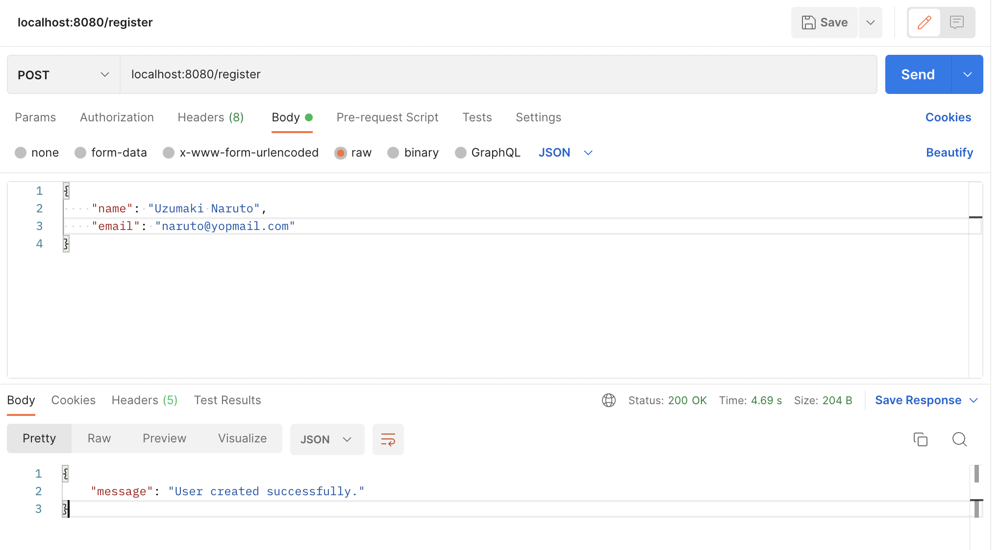
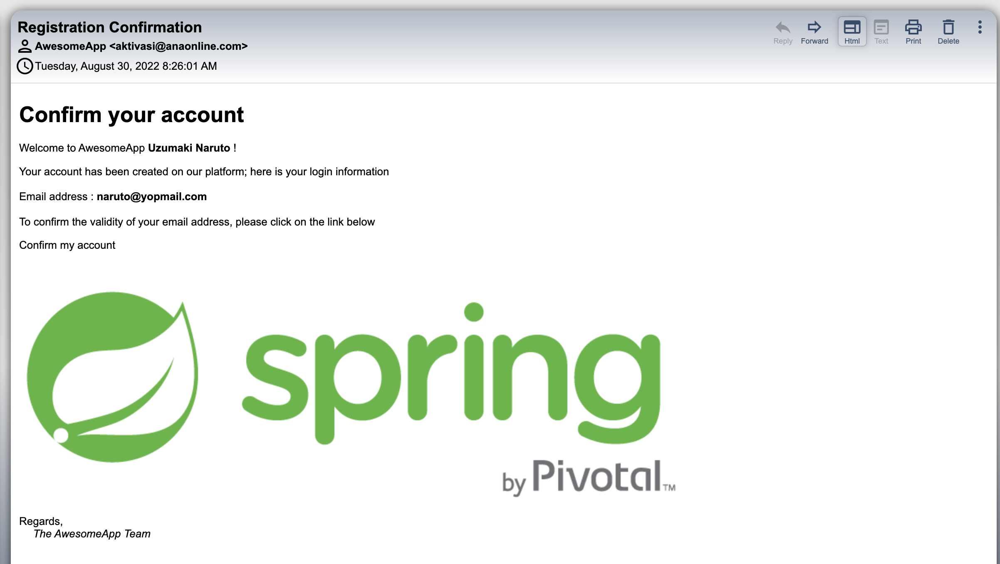

# spring-boot-mailgun-template

### Things todo list:

1. Clone this repository: `git clone https://github.com/hendisantika/spring-boot-mailgun-template.git`
2. Navigate to the folder: `cd spring-boot-mailgun-template`
3. Create [MailGun](https://mailgun.com/) Account and set SMTP & API KEY
4. Change SMTP & API KEY with your MailGun credentials
5. Run the application: `mvn clean spring-boot:run`
6. Open POSTMAN APP

```shell
curl --location --request POST 'localhost:8080/register' \
--header 'Content-Type: application/json' \
--data-raw '{
    "name": "Uzumaki Naruto",
    "email": "naruto@yopmail.com"
}'
```

### Image Screenshot

Send Email



Email Recieved

